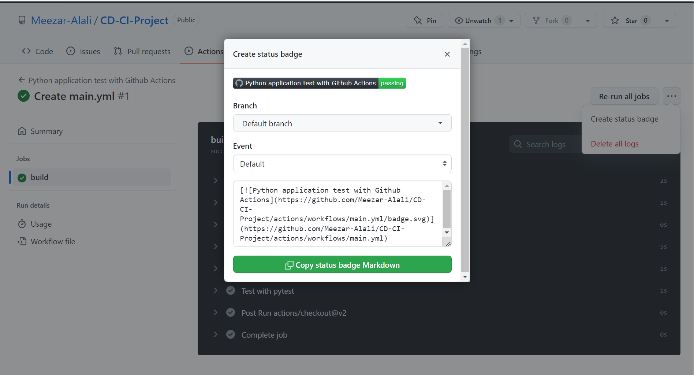
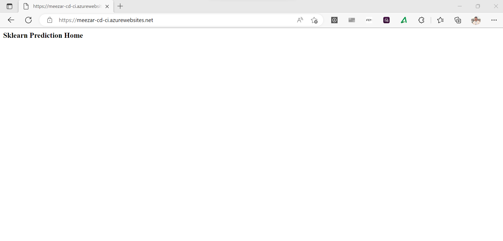
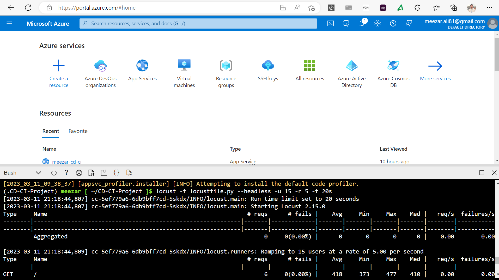

[](https://github.com/Meezar-Alali/CD-CI-Project/actions/workflows/main.yml)

# Agile Development with Azure Project: Building a CI/CD Pipeline

## Overview
This project demonstrates the advantages of automating DevOps with CI/CD pipelines.
A Machine Learning web application is built, test, and deployed using Github Actions and Azure pipelines.

The [project plan](#project-plan) is followed by [instructions](#instructions) that detail the following steps:

   * [Cloning ](#cloning)

   * [Deploying to Azure App Services](#deploying-to-azure-app-services)

   * [Setting up CI/CD using Azure Pipelines](#setting-up-cicd-using-azure-pipelines)


A short [demo](#demo) .

## Status

[](https://github.com/Meezar-Alali/CD-CI-Project/actions/workflows/main_meezar-cd-ci.yml)


-->

## Project Plan

The [Weekly plan](../../raw/main/projectplan/project-management.xlsx) 


## Instructions

The overall architecture of this project is as follows:


The code resides in a GitHub repo together with test cases that can be used for quality assurance.

Continuous Integration (CI) of the code is performed upon each commit via GitHub Actions, see [Setting up CI using Github Actions](#setting-up-ci-using-github-actions).

The code can be executed in the cloud as a webapp in Azure App Services, see [Deploying to Azure App Services](#deploying-to-azure-app-services).

Finally, the combination of Continuous integration and Continuous Delivery (CI/CD) via Azure Pipelines is used to automatically reflect all comitted changes in the running webapp, see [Setting up CI/CD using Azure Pipelines](#setting-up-cicd-using-azure-pipelines).

### Cloning

Head to https://github.com and clone the repo https://github.com/Meezar-Alali/CD-CI-Project.
As the following.

Login to Azure and open the Azure cloud shell.

Clone this project from github and change to the project directory:
```bash
meezar [ ~ ]$ git clone ttps://github.com/Meezar-Alali/CD-CI-Project.git
ameezar [ ~ ]$ cd CD-CI-Project
```

Create a virtual environment and source it:
```bash
meezar [ ~/CD-CI-Project ]$ make setup
meezar [ ~/CD-CI-Project ]$ source ~/.CD-CI-Project/bin/activate
```


Build locally using 'make all' which will install all dependencies, perform linting and testing:
```bash
a(.CD-CI-Project) meezar [ ~/CD-CI-Project ]$ make all
```


### Setting up CI using Github Actions


Enable Github Actions by clicking on 'Actions', then click on "set up a workflow yourself' and use the GitHub Actions yaml file [.github/workflows/main.yml](.github/workflows/main.yml) as a template.

Once the workflow is created it is automatically triggered and should show a passing build:



### Deploying to Azure App Services
Install the app to Azure app services using the free tier:
```bash
(.CD-CI-Project) meezar [ ~/CD-CI-Project ]$ az webapp up -n meezar-cd-ci --sku F1
```

Check if the app is up and running by opening the URL containing the webapp name provided in the previous step: https://meezar-cd-ci.azurewebsites.net/



Edit file 'make_predict_azure_app.sh' and replace '< yourappname >' with my webapp name (e.g. meezar-cd-ci).

Test the remote webapp:
```bash
(.CD-CI-Project) meezar [ ~/CD-CI-Project ]$ ./make_predict_azure_app.Unix.sh
```


Logs of your running webapp can be accessed in two ways:

A. Via the public endpoint by appending '/api/logs/docker': https://meezar-cd-ci.scm.azurewebsites.net/api/logs/docker

B. Via  cloud shell as a stream:
```bash
(.CD-CI-Project) meezar [ ~/CD-CI-Project ]$ az webapp log tail
```


Performance validation of the webapp can be performed via a load test using [locust](https://locust.io).
Replace '< yourappname >' in the provided configuration and call locust:
```bash
(.CD-CI-Project) meezar [ ~/CD-CI-Project ]$ nano locustfile.py
(.CD-CI-Project) meezar [ ~/CD-CI-Project ]$ locust -f locustfile.py --headless -u 15 -r 5 -t 20s
```
Using the parameters above locust will use 15 users with a spawn rate of 5 users per second and run for 20 seconds:



### Setting up CI/CD using Azure Pipelines
Now sufficient to setup a pipeline.

Open Azure devops in a browser https://dev.azure.com.

Create a new project calle CD-CI-Project


Then click on 'New pipeline'.

When you are asked 'Where is your code?' select Github and choose your cloned repo.
We have to enable Allow public pipeline in pipeline setting 


Configure the pipeline as a "Python to Linux Web App on Azure", select my subscription and the webapp name(meezar-cd-ci).
then lick on 'Validate and configure'.


Notice 'Pipelines' now see a first successfull run of the pipeline including the 'Build stage' and the 'Deploy Web App' stage:


From now on every change to your code will trigger the CI/CD pipeline and update your webapp accordingly:


## Demo

A short demo demonstrates the main steps of the project:


